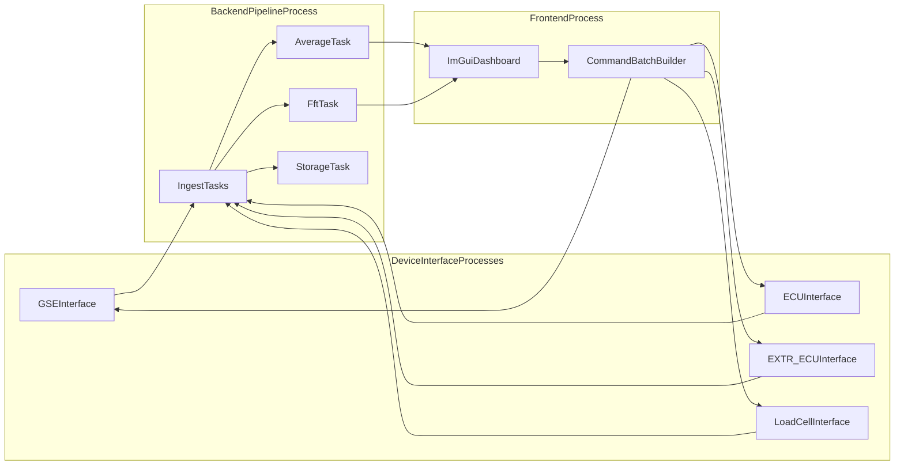

# UCIRPLGUI End-to-End Implementation Plan

## Scope
Implement the remaining UCIRPLGUI runtime under [C:/Users/david/VIVIIan/UCIRPLGUI/src/ucirplgui/](C:/Users/david/VIVIIan/UCIRPLGUI/src/ucirplgui/) with:
- Four independent device-interface processes (GSE, ECU, EXTR_ECU, LOADCELL)
- A backend pipeline process for ingestion, processing (FFT/averaging), and fanout
- A frontend process that renders a DashboardPage-like ImGui dashboard in tau-ceti
- Typed float64 connector streams for telemetry and commands

## Architecture Decisions (locked from your answers)
- **Process model:** one process per board interface + backend + frontend
- **Frontend scope:** parity with `DashboardPage.jsx` sections/controls/charts (implemented with viviian widgets)
- **Command transport:** typed numeric table batches (`float64`) with fixed column order per stream
- **Transport primitive:** `SendConnector` / `ReceiveConnector` from [C:/Users/david/VIVIIan/src/viviian/connector_utils/connectors.py](C:/Users/david/VIVIIan/src/viviian/connector_utils/connectors.py)

## Target Files
- [C:/Users/david/VIVIIan/UCIRPLGUI/src/ucirplgui/config.py](C:/Users/david/VIVIIan/UCIRPLGUI/src/ucirplgui/config.py)
- [C:/Users/david/VIVIIan/UCIRPLGUI/src/ucirplgui/device_interfaces/device_interfacees.py](C:/Users/david/VIVIIan/UCIRPLGUI/src/ucirplgui/device_interfaces/device_interfacees.py)
- [C:/Users/david/VIVIIan/UCIRPLGUI/src/ucirplgui/backend/pipeline.py](C:/Users/david/VIVIIan/UCIRPLGUI/src/ucirplgui/backend/pipeline.py)
- [C:/Users/david/VIVIIan/UCIRPLGUI/src/ucirplgui/frontend/frontend.py](C:/Users/david/VIVIIan/UCIRPLGUI/src/ucirplgui/frontend/frontend.py)
- [C:/Users/david/VIVIIan/UCIRPLGUI/src/ucirplgui/components/dashboard.py](C:/Users/david/VIVIIan/UCIRPLGUI/src/ucirplgui/components/dashboard.py)
- [C:/Users/david/VIVIIan/UCIRPLGUI/src/ucirplgui/__init__.py](C:/Users/david/VIVIIan/UCIRPLGUI/src/ucirplgui/__init__.py) and package `__init__` files as needed for import stability

## Implementation Steps
1. **Define connector and stream contracts in config**
   - Add non-conflicting host/port constants for:
     - each board telemetry outbound connector
     - backend processed outbound connector(s)
     - frontend command outbound connector(s)
     - per-board command inbound connector(s)
   - Add fixed schemas/column-order definitions for typed float64 streams (telemetry raw, FFT output, averaged output, command streams).

2. **Implement board-specific device interfaces**
   - Build one class per board in `device_interfacees.py`: `GSEDeviceInterface`, `ECUDeviceInterface`, `EXTRECUDeviceInterface`, `LoadCellDeviceInterface`.
   - Each interface:
     - opens socket connection to simulator board endpoint
     - decodes exact binary packets (rocket2-compatible)
     - emits normalized float64 telemetry batches via board `SendConnector`
     - receives command batches from frontend->device command connector and encodes/sends command packets where applicable (GSE/ECU)
   - Include reconnect handling and bounded polling loops.

3. **Implement backend pipeline task graph**
   - In `backend/pipeline.py`, build connector receivers for all board telemetry streams.
   - Add processing tasks:
     - pass-through normalization task for frontend-ready unified telemetry stream(s)
     - FFT task for selected channels
     - averaging/downsample task for frontend chart-friendly cadence
     - storage task sink (append-only file/structured store hook with clear interface)
   - Publish processed outputs via backend `SendConnector`s.

4. **Implement frontend runtime and dashboard composition**
   - In `frontend/frontend.py`, build a `viviian.frontend.Frontend` runtime:
     - receive processed telemetry connectors from backend
     - mount dashboard component from `components/dashboard.py`
     - publish typed command streams back to device interfaces
   - Ensure tau-ceti theme setup and clean window lifecycle.

5. **Build DashboardPage-equivalent ImGui dashboard**
   - In `components/dashboard.py`, compose sections similar to React dashboard:
     - GSE panel controls + gauges
     - ECU panel controls + gauges + abort workflow
     - central chart stack (tank pressures, line pressures, load cell)
     - tooling interactions (pressure fill/decay style behavior)
   - Use viviian primitives (`SensorGraph`, gauges, buttons, chrome/operator widgets) and maintain a clear state model.

6. **Close command loop and process boundaries**
   - Ensure frontend command actions are serialized into fixed-column command batches.
   - Ensure per-board device interface consumes those commands and applies them to simulator socket endpoints.
   - Verify each process can run independently using only network connectors/sockets (no shared in-process state).

7. **Stabilize imports and runnability**
   - Fix invalid imports/placeholders in package files touched by this path so backend/frontend/device-interface processes start cleanly.
   - Keep changes confined to UCIRPLGUI runtime surface and connector boundaries.

## Dataflow

## Verification Plan
- Start simulator service, then launch all six processes independently.
- Validate connector health and continuous updates on all streams.
- Verify dashboard controls change simulator behavior (pressure/valve response).
- Verify FFT and averaged streams update in frontend charts.
- Verify storage sink writes expected records without blocking hot paths.
- Run lint/compile checks on all edited UCIRPLGUI files.
