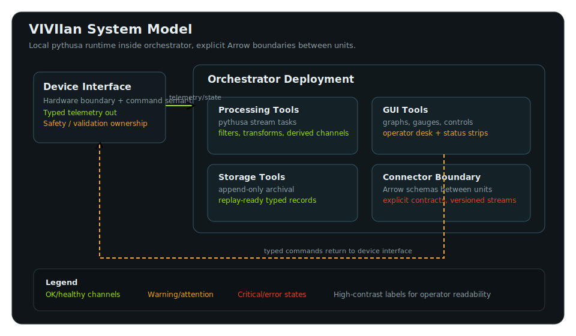

# VIVIIan

VIVIIan is a Python-first architecture and toolkit for hardware-agnostic telemetry and control systems.
It is designed around typed numeric streams, explicit runtime boundaries, deterministic reconstruction, and operator-facing tool collections composed by a local orchestrator runtime.



The architecture document is the primary source of truth for the intended system shape:

- `docs/architecture.md` in the docs site
- `architecture.md` as the mirrored root copy

## What Exists Today

The repo already contains working pieces of that larger architecture:

- `gui_utils` for ImGui graph and button primitives
- `gui_utils/3dmodel.py` for the compact OBJ-backed 3D viewer runtime
- `simulation_utils` for deterministic repeating signal simulators in NumPy `rfft` space
- `deviceinterface` for an early Arrow batch streaming boundary
- `connector_utils` for initial strict-schema Arrow Flight connector primitives
- `datastorage_utils` for append-only Parquet persistence
- `orchestrator` for the early `pythusa.Pipeline`-subclass composition layer
- `tests/gui_runnables/signal_graph_lab.py` and `tests/gui_runnables/rocket_viewer_lab.py` for manual end-to-end GUI examples

Other architecture-aligned areas still exist only partially right now, especially reusable processing tools, tighter orchestrator composition helpers, and the larger multi-deployment runtime. The repo should be read as an in-progress implementation of the architecture rather than a finished end-to-end system.

## Documentation

MkDocs content lives under `docs/`. The most important pages are:

- `docs/architecture.md` for the target system model
- `docs/getting-started.md` for local setup and runnable commands
- `docs/gui-utils.md`, `docs/3d-viewer.md`, and `docs/simulation-utils.md` for the working runtime pieces

Local docs commands:

```bash
python -m pip install mkdocs
mkdocs serve
mkdocs build
```

## Quick Start

Create and activate a virtual environment, then install the current repo dependencies:

```bash
python3 -m venv .venv
source .venv/bin/activate
pip install -e ".[gui]"
```

## Run Tests

```bash
python -m unittest \
  tests.test_gui_utils \
  tests.test_simulation_utils \
  tests.test_signal_graph_lab \
  tests.test_rocket_viewer_lab \
  tests.test_3dmodel \
  tests.test_gauge_lab \
  tests.test_connector_utils \
  tests.test_datastorage_utils \
  tests.test_deviceinterface_utils \
  tests.test_orchestrator
```

## Run The Signal Lab

Run the command from the repo root. The runnable resolves the repo root and
`src/` automatically when launched directly.

```bash
python tests/gui_runnables/signal_graph_lab.py
```

The signal-lab runnable opens one ImGui window with:

- one `SensorGraph`
- one one-shot button to create 8 random signals
- eight `signal_1` to `signal_8` toggles that control which signals currently feed the graph

## Run The Rocket Viewer Lab

```bash
python tests/gui_runnables/rocket_viewer_lab.py
```

The viewer lab opens one ImGui window with:

- the single `.obj` file discovered under `gui_assets/cad/`
- a compiled mesh cache under `gui_assets/compiled/`
- named rocket parts bound to scalar telemetry streams, including `g_Body1788` and `g_Body1844`
- one live orientation stream built from repeating roll/pitch/yaw signals
- orbit, pan, and zoom controls inside the ImGui-hosted viewport

The viewer lab expects exactly one CAD file in:

```text
gui_assets/cad/
```

## Current Status

Implemented now:

- graph configuration, rendering, TOML export, and reconstruction
- generic state buttons for ImGui desks
- deterministic signal generation from sparse `rfft` coefficients
- a compact OBJ-backed 3D viewer runtime and example
- an early `deviceinterface` Arrow streaming path
- strict-schema Arrow Flight send/receive connector primitives
- append-only Parquet storage helpers
- an early `Orchestrator` composition root built on `pythusa.Pipeline`
- working manual GUI examples and regression tests

Still incomplete relative to the architecture:

- higher-level processing tool collections
- richer orchestrated topology and deployment launch helpers
- the full deviceinterface/orchestrator runtime described in `architecture.md`
