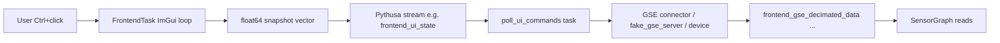

# Adding buttons to frontend.py
_Exported on 5/17/2026 at 02:43:43 PDT from Cursor (3.4.17)_

---

**User**

what is the simplest way to add buttons to @apps/GUI2.1/frontend.py from viviian, tell me hw the work and where the buttons would output their data to 

---

**Cursor**

Exploring the GUI2.1 frontend and how it connects to the rest of VIVIIan.


Here’s how buttons fit into your current `frontend.py` setup and the viviian stack.

## Simplest path: `frontend.add(...)` with viviian button widgets

Your GUI already uses viviian’s `Frontend` + `SensorGraph`. Buttons follow the same pattern: import from `viviian.gui_utils`, then add them in `build_frontend()` next to the graph.

```python
from viviian.gui_utils import ToggleButton, MomentaryButton, SetpointButton

def build_frontend():
    frontend = Frontend("gui2_1_frontend")
    frontend.add(
        ToggleButton(
            button_id="gse_arm",
            label="Arm GSE",
            state_id="gse.arm",   # logical name for gating/interlocks
            state=False,
            theme_name="tau_ceti",
        )
    )
    frontend.add(
        MomentaryButton(
            button_id="gse_pulse",
            label="Fire pulse",
            state_id="gse.pulse",
            state=1.0,            # value emitted on press
            theme_name="tau_ceti",
        )
    )
    frontend.add(SensorGraph(...))  # existing graph
    return frontend
```

Reference examples: `tests/test_frontend.py` and `tests/gui_runnables/frontend_lab.py`.

**Button types:**

| Type | Behavior | Output |
|------|----------|--------|
| `ToggleButton` | Stays on/off | `0.0` or `1.0` |
| `MomentaryButton` | One-shot pulse | `state` on press, then back to `0.0` |
| `SetpointButton` | Numeric with − / input / + / SET | Confirmed float in range |

**Important UX detail:** In tau_ceti (and legacy), operational clicks require **Ctrl + click** — a deliberate safety guard in `buttons.py`.

---

## How they work internally

1. **`build_frontend()`** registers widgets; `frontend.compile()` builds adapters and **output slots** (one float64 per writable control).
2. **`frontend.build_task(...)`** runs the ImGui loop (GlfwBackend): each frame it renders widgets, and when a button changes, it marks a “dirty” snapshot.
3. **`FrontendTask`** packs writable control values into a **1D `float64` vector** and calls `writer.write(snapshot)` on the bound output stream.

That wiring lives in `packages/viviian_core/src/viviian/frontend/runtime.py`:

- Snapshot on startup (initial state).
- New snapshot when a toggle/setpoint changes or a momentary button fires.
- Momentary buttons reset to `0.0` after a successful write (`after_snapshot_written`).

`state_id` is mainly for **gates/interlocks** between buttons (e.g. only enable B when `state_id` X is true). It is **not** the pipeline index; the index comes from `frontend.output_slots`.

---

## Where button data goes (and what’s missing in GUI2.1 today)

Right now `apps/GUI2.1/frontend.py` only **reads** telemetry into the graph — the GUI task has no output stream:

```156:160:apps/GUI2.1/frontend.py
        pipeline.add_task(
            "frontend_gui",
            fn=frontend_task,
            reads=frontend.read_bindings(),
        )
```

So today, buttons would render but **nowhere would receive their values** until you add an output path.

### Step 1 — Pythusa output stream (in `main()`)

After `build_frontend()` / before `pipeline.run()`:

```python
frontend.compile()
# frontend.output_shape == (N,) where N = number of buttons/setpoints
pipeline.add_stream(
    "frontend_ui_state",
    shape=frontend.output_shape,
    dtype=np.float64,
    cache_align=True,
    frames=256,
)
```

### Step 2 — Wire the GUI task to write that stream

```python
pipeline.add_task(
    "frontend_gui",
    fn=frontend_task,
    reads=frontend.read_bindings(),
    writes=frontend.write_bindings("frontend_ui_state"),  # {"output": "frontend_ui_state"}
)
```

`write_bindings()` returns `{"output": "<stream_name>"}` — the task expects the kwarg `output=...` (see `FrontendTask._resolve_writer_binding`).

### Step 3 — Consumer task (your top-of-file comment)

Your comments describe the intended pattern: a **separate pipeline task** polls `frontend_ui_state`, maps indices to buttons, triggers GSE/commands, then relies on the stream ring (not blocking the GUI).

Minimal consumer sketch:

```python
def poll_ui_commands(*, output, frontend, gse_writer=None):
    slots = frontend.output_slots  # compile first
    while True:
        frame = output.read()
        if frame is None:
            time.sleep(0.01)
            continue
        for slot, value in zip(slots, frame):
            if value == 0.0:
                continue
            # slot.component_id e.g. "gse_arm"
            # slot.state_id e.g. "gse.arm"
            if slot.component_id == "gse_arm" and value > 0.5:
                ...  # send command via gse_writer / connector / grpc
```

Index order matches **add order** of writable widgets in `build_frontend()`:

```python
for i, slot in enumerate(frontend.output_slots):
    print(i, slot.component_id, slot.state_id, slot.initial_value)
```

Tests show the exact semantics: toggle `0→1`, momentary `0→pulse→0` (`tests/test_frontend.py`, `test_frontend_task_runs_inside_pipeline` uses stream `"ui_state"`).

---

## End-to-end data flow



- **Display path (already wired):** GSE → `frontend_gse_decimated_data` → per-signal graph streams → `SensorGraph`.
- **Control path (not wired yet):** Buttons → `frontend_ui_state` → your poller → backend/GSE.

`frontend_lab.py` is the closest standalone example: GUI writes to a ring buffer and `StatePrinter` reads and prints `{component_id=value}` pairs.

---

## Practical recommendations for GUI2.1

1. Start with one `ToggleButton` + one `MomentaryButton` and a debug poller that `print`s `frontend.output_slots` + frame values (like `StatePrinter`).
2. Use unique `button_id`s; duplicate IDs fail at compile time.
3. Keep command logic out of the GUI task — match your comment: GUI only publishes state; a timer/poll task rate-limits commands.
4. When you hook real GSE control, that poller would write to whatever `gse_connector.py` / `fake_gse_server.py` expects (separate from the graph’s read-only telemetry flight on port 8819).

I’m in **Ask mode**, so I can’t edit `frontend.py` for you. If you want this wired end-to-end in the repo, switch to Agent mode and say which buttons/commands you need first.

---

**User**

why do the streams split all the data into many different streams

---

**Cursor**

Tracing how graph widgets consume streams and why the pipeline splits GSE data per signal.


The split is not “throw away the unified table” — it’s **one wide telemetry stream, then an adapter layer** so the graph widgets can consume it the way viviian expects.

## Two layers, two shapes

**1. Canonical GSE table (one stream)**  
`frontend_gse_decimated_data` stays a single matrix:

- Shape: `(50 rows, N signals)` — all columns from `GSE_SIGNAL_LISTS`
- Written by the gRPC flight server task
- Matches how connectors/storage think about telemetry: one frame = one time slice × many channels

**2. Per-signal plot streams (many streams)**  
`gse_split_to_graph_streams` reads that table once per frame and writes one stream per plotted signal:

```65:77:apps/GUI2.1/frontend.py
def gse_split_to_graph_streams(*, stream, **graph_writers) -> None:
    """Split (rows, signals) telemetry into per-signal (2, rows) graph streams."""
    while True:
        frame = stream.read()
        ...
        x_values = frame[:, 0]
        for i, name in enumerate(GSE_VALUE_SIGNALS):
            ...
                out = np.vstack((x_values, frame[:, i + 1])).astype(np.float64, copy=False)
                writer.write(out)
```

Each `gse_graph_<signal>` has shape `(2, 50)`: row 0 = time (`packet_time`), row 1 = that signal’s values.

So the data is **fan-out**, not duplicated upstream storage — the wide stream is still the source of truth for that pipeline.

---

## Why viviian wants many streams here

### 1. `SensorGraph` is built around **one stream per series**

Each `GraphSeries` has its own `stream_name`. On each frame, the graph **binds and drains a separate reader** per series:

```268:278:packages/viviian_core/src/viviian/gui_utils/graphs.py
    def consume(self) -> bool:
        had_update = False
        for item in self.series:
            reader = self._readers.get(item.stream_name)
            ...
            for frame in drain_numeric_reader(reader):
                frame_latest = self._series_runtime[item.series_id].append_batch(frame)
```

And it **requires unique** `stream_name` values within a graph — you can’t point two series at the same stream name.

Your `build_frontend()` assigns one stream per GSE channel (`gse_graph_supplyVoltage0`, etc.), so the pipeline must provide those streams.

### 2. Plot widgets expect shape `(2, rows)`, not `(rows, cols)`

`normalize_numeric_batch` hard-requires:

```138:139:packages/viviian_core/src/viviian/gui_utils/_streaming.py
    if batch.ndim != 2 or batch.shape[0] != 2:
        raise ValueError(f"Expected {context_name} shape (2, rows), got {batch.shape}.")
```

The flight stream is `(rows, signals)`. Something has to **reshape** column `i` into `[timestamps; values]`. That’s exactly what `gse_split_to_graph_streams` does.

### 3. Pythusa streams have a **fixed declared shape**

In `main()`, every stream’s shape is fixed at `add_stream` time. A single ring can’t cleanly be “wide matrix” for the server and “`(2, rows)` time series” for the graph without **one side owning regrouping** — which is what the orchestrator docs describe as “structural contract vs local read window.” The split task is that regrouping owner.

### 4. Independent consumers / backpressure

Each per-signal ring (`frames=256`) is its own queue. The GUI task consumes series one reader at a time; separate streams mean each line can be drained on its own schedule without a custom “slice column 3 from the big matrix” reader in the widget layer.

(If two widgets shared the *same* stream name, `fan_out_reader_groups` in the frontend runtime can duplicate reads — but **different series in one graph still need different stream names** by design.)

---

## What is *not* split

| Stream | Role |
|--------|------|
| `frontend_gse_decimated_data` | Wide GSE frame for flight/grpc and anything that wants all signals together |
| `gse_graph_*` | Narrow `(time, value)` batches **only** for plotting |

Backend pipelines (ECU, load cell, etc.) also keep **one wide stream per subsystem** — GUI2.1 only adds the extra streams on the frontend path for the multi-series graph.

---

## Could it be one stream?

**With stock viviian:** practically no, not for a multi-series `SensorGraph` over many channels — you’d need either:

- one stream per series (current approach), or  
- a custom widget that reads the wide matrix and feeds internal series buffers itself.

**In theory:** one shared wide stream + fan-out inside `consume()` would work, but that logic isn’t in `SensorGraph`; the split task is the small, explicit adapter.

---

## Short mental model

```text
GSE device / connector
        ↓
frontend_gse_decimated_data   ← "spreadsheet": many columns, one frame
        ↓  gse_split_to_graph_streams
gse_graph_pressureGn2         ← "oscilloscope trace": [time row, value row]
gse_graph_temperatureEngine1
...
        ↓
SensorGraph (one reader per trace)
```

So: many streams exist because **telemetry arrives as a table**, but **viviian graphs consume independent `(2, rows)` time-series channels**, and the pipeline keeps those contracts explicit rather than hiding reshaping inside the GUI loop.

---

**User**

so it is a limitation of the sensor graph that wants these things, does that impact perfromance alot or is the flexibiity worth it 

---

**Cursor**

Yes — **for your current setup, it’s mainly a `SensorGraph` / viviian streaming contract**, not something Pythusa forces on its own. The wide `frontend_gse_decimated_data` stream is the natural shape for telemetry; the per-`gse_graph_*` streams exist so each `GraphSeries` gets its own `(2, rows)` reader.

## Does it hurt performance much?

**For GUI2.1 as it is now: almost certainly not.**

Rough scale (from your constants):

- ~12 plotted signals (everything except `packet_time`)
- 50 rows per frame, decimated data
- 256-frame rings per stream

**CPU:** `gse_split_to_graph_streams` does one read, then ~12 small `vstack`s on 50-point slices. That’s cheap compared to ImGui drawing, GLFW, and the graph’s own downsampling/trim logic.

**Memory:** You pay for **extra ring buffers** (one per series). Each is small (~200 KB per stream at those dimensions), so you’re in the low single-digit MB range total — not nothing, but not a bottleneck on a desktop.

**Redundancy:** `packet_time` is copied into every per-signal stream (same X row repeated 12 times). That’s the main “waste”; it only starts to matter if you scale to **hundreds of channels** or **very high frame rates**.

**GUI side:** `SensorGraph.consume()` hits each reader separately. Again fine for ~12 series; annoying only at much larger scale.

So: **limitation of the widget API + pipeline shape rules**, with **modest overhead** at your current sizes.

## Is the flexibility worth it?

**Worth it if you value:**

- **Composable pipelines** — flight/storage stays on the wide stream; plotting is an adapter task you can drop or change.
- **Mixed sources** — different series can come from different tasks/streams (GSE pressure from one place, ECU from another) in one graph.
- **Stock widgets** — no custom “slice column N from matrix” code in the GUI loop.
- **Independent rings** — each trace has its own queue/backpressure (usually irrelevant at 12 signals, useful in bigger systems).
- **Consistency** with the rest of viviian (`frontend_lab`, tests, docs all use one stream per series).

**Less worth it if:**

- You plot **hundreds** of channels at kHz.
- You’re **memory-tight** (embedded).
- Every series always shares **one** wide frame and you never mix sources — then a single stream + in-graph slicing would be leaner (but you’d extend or bypass `SensorGraph`).

## Practical takeaway

| Concern | At GUI2.1 scale | If you 10× channels/rate |
|--------|------------------|---------------------------|
| CPU split | Negligible | Revisit |
| RAM (extra rings) | ~few MB | Revisit |
| Code clarity | Good | Still good |
| Custom wide-matrix graph | Possible, more work | Might be better |

**Bottom line:** It’s a **deliberate design trade**, not an accident. For a GSE desk with ~12 traces and decimated batches, the flexibility and clarity are worth the small cost. You’d only feel it if the graph grew into a high-channel-rate scope — then you’d either fuse streams in one task or teach the graph to consume a wide matrix directly.

---

**User**

its done this way because yoy may want to graph things that all have different time stamps or come from different devices 

---

**Cursor**

Yes — that’s the right **design reason** for the API, even though **GUI2.1 doesn’t use that flexibility yet**.

**What viviian’s model enables**

- Each `GraphSeries` binds to its own `stream_name`.
- Each stream is an independent `(2, rows)` batch: row 0 = that series’ times, row 1 = values.
- So one `SensorGraph` can mix:
  - GSE pressure from a GSE task
  - ECU temperature from an ECU task
  - Synthetic or logged data from somewhere else  
  …with **different sample times, rates, and frame sizes** per trace.

`SensorGraph` keeps **separate history per series** and overlays them; it doesn’t assume all columns came from one wide matrix frame.

**What your app does today**

In `gse_split_to_graph_streams`, every series gets the **same** `packet_time` column from one `frontend_gse_decimated_data` frame:

```python
x_values = frame[:, 0]  # same for all signals
```

So right now it’s “one device, one clock, many channels” — the split is mostly **shape adaptation** for `SensorGraph`, not because GSE channels have different timestamps.

**Short version**

| Idea | True in general? | True in GUI2.1 now? |
|------|------------------|---------------------|
| Different devices on one graph | Yes | Not yet (GSE only) |
| Different timestamps per series | Yes | No (shared `packet_time`) |
| Per-stream `(2, rows)` contract | Yes | Yes |

So your intuition matches **why viviian is built this way**. Your pipeline is the simple case today; the extra streams buy you room to grow into mixed-source / mixed-time plots without changing the graph widget.

---

**User**

what does state = false mean for buttons

---

**Cursor**

`state=False` only applies meaningfully to **`ToggleButton`** — it’s the button’s **starting on/off value**, not a pipeline binding and not the same as `state_id`.

## `ToggleButton`: `state=False` = starts OFF

```python
ToggleButton(
    button_id="gse_arm",
    label="Arm GSE",
    state_id="gse.arm",
    state=False,   # ← initial toggle position
)
```

| `state` | UI label | Value written to output stream |
|--------|----------|--------------------------------|
| `False` | `Arm GSE [OFF]` | `0.0` |
| `True` | `Arm GSE [ON]` | `1.0` |

On **Ctrl+click**, it flips: `False → True` (and `0.0 → 1.0`), then back on the next press.

That’s the **in-memory widget state** and what gets published on the frontend output vector (when you wire one). It does **not** by itself send anything to GSE — a separate task has to read `0.0` / `1.0` and act.

## Don’t confuse `state` with `state_id`

- **`state`** — current value of the control (`False` / `True` for toggles).
- **`state_id`** — string label for **gates/interlocks** (e.g. only enable button B when `"gse.arm"` is true). Unrelated to `False`/`True` as a value.

## Other button types use `state` differently

| Button type | What `state` means |
|-------------|-------------------|
| **`ToggleButton`** | Must be `bool`: initial on/off |
| **`MomentaryButton`** | Number (or bool) **sent on press**; stream still starts at `0.0`, then pulses that value, then returns to `0.0` |
| **`SetpointButton`** | Initial **confirmed setpoint** (e.g. `state=42.0`) |

Example:

```python
MomentaryButton(..., state=3.5)   # on press, stream briefly gets 3.5, not "false"
```

**Summary:** For a toggle, `state=False` means “start unchecked / off; publish `0.0` until the operator turns it on.”

---

**User**

lets say the device disconnects, when it reconnects I want it to keep its state, i don't want to override it, how might I make sure that i don't overwrite its current state

---

**Cursor**

Tracing how GUI2.1 and viviian handle disconnect/reconnect and where state might get reset or overwritten.


The risk on reconnect is usually **sending a full “all off” command** because the GUI or poller still thinks the default is `state=False`, not because the device forgot. You want **device truth on link-up**, **edge-triggered sends**, and **no blind replay** of the UI’s initial snapshot.

## Two different “states”

| State | Where it lives | On disconnect |
|--------|----------------|----------------|
| **Actual** (valves, igniters) | GSE hardware | Often unchanged |
| **Desired** (operator intent) | GUI toggles / `ui_state` stream | Stays if GUI keeps running |
| **Last sent** | Your command poller / connector | Often lost unless you store it |

`ToggleButton(..., state=False)` is only the **starting desired state** when the widget is created. It becomes dangerous if something treats that as “send OFF to the device” on every connect or every poll.

## What usually causes the overwrite

**1. Level-triggered command loop (most common)**  
If a task reads `ui_state` and **always** sends the full 12-bool command frame whenever it sees a value (including `0.0` for every toggle), then on reconnect you effectively say “set everything false” even though the hardware still has valves open.

Your `frontend.py` comment already points at the safer pattern: poll state, **only act on changes**, then reset/consume — not “blast the whole vector every tick.”

**2. Frontend’s initial snapshot**  
When writable buttons exist, `FrontendTask` writes an **initial** snapshot at startup (all toggles → `0.0` if `state=False`). A naive poller that treats every stream write as “send command” will fire once at GUI start and again after any reconnect of that pipeline.

**3. Connector / test harness assuming empty commands**  
`fake_gse_server` starts each TCP session with `cmd_bools = [False] * 13` until it receives commands — so in sim, a reconnect looks like “everything off” until you send again. Real GSE may differ; your telemetry already carries **echo of internal state**:

```62:78:apps/GUI2.1/gse_connector.py
GSE_FIELD_NAMES: Final[List[str]] = [
    ...
    "solenoidInternalStateGn2Fill",
    "solenoidInternalStateGn2Vent",
    ...
]
```

Use those as **actual state**, not the GUI default.

**4. GUI restart vs device reconnect**  
If only the **connector** reconnects but the **GUI** keeps running, toggles may still show ON (good). If the **GUI** restarts with `state=False`, the display is wrong until you sync from telemetry — and a dumb poller can still push OFF to the device.

---

## Patterns that avoid overwriting device state

### 1. Device is source of truth after link-up (recommended)

On connect / first good telemetry frame:

1. Parse `solenoidInternalState*` (and related bools) from the GSE packet.
2. Seed a **`last_known_device_cmds`** (or `synced` flag).
3. Optionally align GUI “desired” with that (harder today; see below).
4. **Do not send TCP commands** until sync is done (or link is `connected`).

Then the operator sees reality before anything can change the board.

### 2. Edge-triggered commands only (matches your comment)

Keep in the poller:

```text
last_sent[button_id]   # or full 12-vector
last_seen[button_id]   # from ui_state stream
```

Only when `ui_state` **changes** (False→True or True→False), build and send a command.  
Ignore:

- repeated identical snapshots  
- the initial all-`0.0` snapshot unless the operator actually toggled  
- stream reads while `link_state != connected`

For `MomentaryButton`, you already get a pulse then `0.0` — treat that as a **one-shot edge**, not “turn everything off.”

### 3. Separate “desired” from “applied”

```text
desired  ← GUI ui_state (what operator wants)
applied  ← last successful command OR telemetry internal states
```

Send only when `desired != applied` **and** link is up **and** (optional) operator confirmed / interlocks OK.  
On reconnect: set `applied` from telemetry, **not** from `ToggleButton(state=False)`.

Docs call this out explicitly: avoid **“a command stream that repeats the same value unnecessarily”** (`docs/build-device-interfaces.md`).

### 4. Gate commands on connectivity

Publish link state separately (connected / stale / disconnected). While disconnected:

- keep consuming telemetry if any (usually none)  
- **never** forward `ui_state` to TCP  
- on transition to connected → run sync-from-telemetry once, then enable sends  

That stops reconnect from being interpreted as “send defaults.”

### 5. Don’t restart the connector with a fresh all-false buffer

`gse_connector` today holds one TCP socket; if you rebuild the connector on disconnect, any in-memory command shadow is lost. Either:

- reconnect TCP inside the same process and **re-sync from device** before sending, or  
- persist `last_sent` / `last_desired` in a long-lived task that survives socket churn  

---

## GUI toggle display vs device truth

viviian toggles are **not** automatically tied to GSE telemetry. So:

- **Device reconnect, GUI still running:** toggles can stay ON while device was always ON — good for desired state; bad only if poller sends OFF.  
- **GUI restart:** widgets reset to `state=False` unless you add a sync path.

To mirror device on reconnect you’d add something like:

- a small task that reads decimated GSE telemetry and maps internal solenoid fields → a “display state” stream, **or**  
- on first post-connect frame, update your poller’s `desired` from telemetry so GUI and device match (updating live `ToggleButton.state` from another task isn’t wired in stock viviian — often easier to drive **command shadow state** first and let the operator see telemetry on the graph until you add explicit sync).

---

## Practical checklist for GUI2.1

1. **Poller:** send on **change** only; ignore duplicate frames and initial snapshot unless you track “has_operator_input.”  
2. **On link-up:** read one telemetry frame → seed `applied` from `solenoidInternalState*`.  
3. **While disconnected:** no commands to TCP.  
4. **Don’t** map `state=False` to “command all solenoids off” on reconnect.  
5. **Testing:** remember `fake_gse_server` resets command bools per **new TCP client** — use telemetry internal states to verify sync logic.

---

**Bottom line:** The device can keep its state; you avoid overwriting it by **syncing from telemetry after reconnect** and **only sending commands when the operator (or desired state) changes**, not when the GUI or pipeline replays defaults. `state=False` is a UI initial value, not “what the GSE should look like after reconnect.”

If you want, in Agent mode we can sketch a concrete `poll_ui_commands` + “sync from `solenoidInternalState*`” layout against your `GSE_CMD_FIELD_NAMES` order.

---

**User**

is there a way to set the button state upon reconnect to reflect the device state? 

---

**Cursor**

Checking whether viviian supports updating button state from telemetry or external input after the frontend is built.


**Short answer:** viviian does **not** have a built-in “on reconnect, read device → update toggles” feature. Buttons are **write-only** to the pipeline (`output` stream). You *can* reflect device state, but you implement it yourself—and in GUI2.1’s multi-task pipeline that usually means **syncing inside the same task that runs the GUI**, not from a separate process.

## What stock `Frontend` supports today

- `ToggleButton.state` is a normal mutable field (`True` / `False`).
- `ButtonComponentAdapter` keeps a separate `_current_value` used for the output snapshot.
- Buttons have **no input streams** (`required_stream_names=()` is empty).
- The frontend task **only writes** `ui_state`; it does **not** read it back.

So there is no API like `frontend.sync_from_telemetry(stream)`.

GUI2.0 already mutates toggles in-process when needed, e.g. `button.state = False` on abort (`apps/GUI2.0/.../dashboard.py`)—same idea you’d use for device sync.

## Device truth you already have

GSE telemetry includes internal solenoid states, e.g. `solenoidInternalStateGn2Fill`, `solenoidInternalStateGn2Vent`, … in `GSE_FIELD_NAMES` (`gse_connector.py`). Those are the right source for “what the board thinks is on” after reconnect.

Map each command toggle to the matching internal-state column (and handle igniters/alarm separately—they don not line up 1:1 with `igniter0` / `igniter1` names).

## Practical ways to sync the UI

### 1. In-process sync (best fit for “buttons match device”)

Keep references to the `ToggleButton` objects you pass to `frontend.add(...)`, and wrap `frontend.build_task(...)` in your own task:

1. On **link-up** (first good telemetry after disconnect), read one frame from `frontend_gse_decimated_data` (or a dedicated bool row).
2. For each toggle, set:
   - `button.state = bool(device_value)`
   - matching adapter `_current_value` to `1.0` or `0.0` (if you only set `button.state`, labels may update on render but the **output vector can stay wrong** until the next click).
3. Run the normal `FrontendTask` loop.

Important: treat this as **display/sync only**—do **not** let the command poller interpret that sync as an operator edge unless you also update its `last_sent` / `last_seen` shadow state.

This must run in the **same process** as the ImGui loop. A separate pipeline task cannot poke Python `ToggleButton` instances in `frontend_gui`.

### 2. Command shadow only (no button relabel)

Easier in a multi-task setup:

- On reconnect, a **poller** seeds `last_sent` / `applied` from `solenoidInternalState*`.
- GUI toggles may still show OFF until the operator clicks.
- You still avoid sending an all-off command to the device.

Good for safety; weaker for operator clarity.

### 3. Show device state without changing toggles

Use telemetry as read-only feedback:

- Extra `GraphSeries` / gauges on internal-state streams, or
- Status text (“GN2 FILL: ON (device)”).

No toggle sync, but honest and works across processes with your existing split streams.

### 4. Custom component (longer term)

Implement `FrontendComponent` with a `required_streams()` input and render logic that reflects stream bools—viviian’s extension path if you want reconnect sync to be first-class in the framework.

## Reconnect flow (recommended)

```text
DISCONNECTED → no commands
CONNECTED    → read telemetry once
              → seed device shadow + (optional) button.state / adapter._current_value
              → mark poller "synced"
OPERATOR     → only send on ui_state *change* after synced
```

Avoid:

- Replaying `state=False` from widget construction as a TCP command.
- Writing a full `ui_state` vector from a side task and expecting the GUI to pick it up (frontend does not read that stream).

## Caveats

| Topic | Note |
|--------|------|
| **Initial GUI snapshot** | Startup still emits `0.0` for `state=False`; poller must ignore until synced or edge-detected. |
| **fake_gse_server** | New TCP session starts with all command bools false; real hardware may not. |
| **Igniters / alarm** | Telemetry names ≠ command names; map carefully. |
| **Momentary buttons** | Usually don’t “sync”; they pulse. |

## Bottom line

**Yes, you can set button state to match the device**, by assigning `ToggleButton.state` (and the adapter’s `_current_value`) from `solenoidInternalState*` when telemetry returns—**inside the GUI task or a single-process app like GUI2.0’s dashboard**. There is **no** stock reconnect hook in `Frontend`; GUI2.1 needs a small wrapper or a custom dashboard layer, plus edge-triggered commands so sync does not pulse the hardware.

If you move to Agent mode, we can sketch that wrapper against your planned toggles and `GSE_CMD_FIELD_NAMES` / internal-state indices.

---

**User**

in @apps/GUI2.1/frontend.py implement this for 2 buttons right now the momentary button of sol_mvas_open and the tobel button of sol_gn2_fill. what should happen is @apps/GUI2.1/gse_connector.py should flight server the commands straight to fronend which will have a recier server. you will ahve all the commands plus one more field that will be 0 for disconnected and 1 for connected. if its not connected you don't allow state changes and whenever you flip from a zero to one you set all the button states to be the states of the commands 

---

**Cursor**

Now I have the exact file contents. Let me edit gse_connector.py first.

Now replace the old `array_to_command_converter` block with the EchoState + factory + Flight echo sender + GseCommandServer wrapper.

Now update `main()` in `gse_connector.py` to start the echo thread, retry the TCP connect, and use the wrapped server.

Now update `frontend.py`. First the imports and constants block:

Now add the `CommandEchoSync` class and replace `build_frontend()` / `main()` with the wired-up versions:

Now update `main()` to add the echo Flight server task, the echo stream, the ui_state output stream, and the writer binding.

Let me verify the final files look right end-to-end.

Done. Here is what got wired up.

## Data flow

```
gse_connector.py main()
  └─ echo_thread → echo_to_flight_connector ──Flight (grpc://localhost:8820)──▶
                                                                                │
frontend.py main() pipeline                                                     │
  └─ task "frontend_gse_command_echo_server"  (StorageServer on 0.0.0.0:8820) ◀─┘
        │  writes (1, 13) frames
        ▼
     stream "frontend_gse_command_echo"
        │  reads
        ▼
  └─ task "frontend_gui" → CommandEchoSync.consume()/render() → buttons
```

## `apps/GUI2.1/gse_connector.py`

- `EchoState` (12 bool commands + `connected` flag, lock-protected).
- `make_array_to_command_converter(echo_state)` — the Flight→TCP converter now also updates `echo_state.commands` on every command frame.
- `GseCommandServer(CommandServer)` — sets `echo_state.connected = False` if the underlying `sendall` raises.
- `echo_to_flight_connector(echo_state, flight_address)` — opens a Flight client and pushes `(1, 13)` rows at 10 Hz; reconnects on error so it survives the frontend coming up late.
- `main()` now starts the echo thread before TCP, retries the GSE `socket.create_connection`, flips `connected` True/False around success/failure, and uses `GseCommandServer` instead of the plain one.
- Exported constants: `ECHO_FIELD_NAMES`, `NUM_ECHO_SIGNALS`, `ECHO_ROWS_PER_FRAME` (used by frontend).

## `apps/GUI2.1/frontend.py`

- Imports `ToggleButton`, `MomentaryButton`, `StateButton` plus the echo constants from `gse_connector`.
- New stream `frontend_gse_command_echo`, shape `(1, NUM_ECHO_SIGNALS)`.
- New stream `frontend_ui_state`, shape `frontend.output_shape` — placeholder writer for the buttons (`FrontendTask` requires it when any button is registered; nothing consumes it yet, that is where a future command poller would read).
- New task `frontend_gse_command_echo_server` reusing `frontend_run_flight_server` on port 8820.
- New `CommandEchoSync` frontend component:
  - `required_streams() == ("frontend_gse_command_echo",)` so the GUI task picks it up via `frontend.read_bindings()`.
  - `consume()` drains all pending echo frames per tick and keeps the latest `(13,)` row.
  - `render()` shows a "GSE link: CONNECTED / DISCONNECTED" status line, sets every wired button's `enabled_by_default` to the current `connected` flag, and on a `0 → 1` edge sets each toggle's `state` (and the adapter's `_current_value`) from the corresponding command bit.
- Two buttons wired:
  - `ToggleButton("gse_sol_gn2_fill", state_id="gse.sol_gn2_fill", state=False, enabled_by_default=False)`
  - `MomentaryButton("gse_sol_mvas_open", state_id="gse.sol_mvas_open", state=1.0, enabled_by_default=False)`
  - The `CommandEchoSync` component is added **first** so its `render()` runs before the button adapters' `render()` each frame, mutating `enabled_by_default` / `state` in time for the same-frame paint.

## Behavior matrix

| Situation | What the operator sees |
|-----------|------------------------|
| Frontend up, connector not started | Status "DISCONNECTED", both buttons disabled (no echo arrived) |
| Connector starts, no TCP yet | Echo flowing with `connected=0` → status "DISCONNECTED", buttons disabled |
| TCP connects | Echo flips to `connected=1` → status "CONNECTED", buttons enabled, toggle re-synced from current command bits |
| TCP drops mid-session | `GseCommandServer` exception flips `connected=0` on the next command → status "DISCONNECTED", buttons disabled |
| TCP reconnects (after retry) | `0 → 1` edge again → buttons re-sync |
| Operator Ctrl+clicks an enabled toggle | Button flips; snapshot written to `frontend_ui_state` (consumer not wired yet) |
| Operator Ctrl+clicks an enabled momentary | Pulse value emitted; resets to 0 on next snapshot |

## Known limitations (worth flagging)

- **Sync source is the connector's command shadow**, not the device's reported `solenoidInternalState*`. So after a connector crash + restart, the synced state is "what the connector currently thinks it has commanded" (starts as all `False`), not "what the GSE board's actual valves are doing." Swapping the sync source to the GSE telemetry would be a follow-on.
- **Disconnection detection is best-effort**: it triggers when a Flight `do_put` to the connector fails (i.e., an operator command can't reach the GSE). A silent TCP drop with no commands flowing won't be noticed until the next command. A periodic heartbeat is the next step if you want sub-second detection.
- **The output stream `frontend_ui_state` has no consumer yet** — it exists because viviian's `FrontendTask` requires a writer when any button is registered. That is where a future command-poll task would read to forward operator presses back through the connector to the GSE.
- **Touches `adapter._current_value`** in `CommandEchoSync.render()` to keep the writer snapshot consistent with the synced display state. Viviian doesn't expose a public setter; the access is noqa'd and commented.

